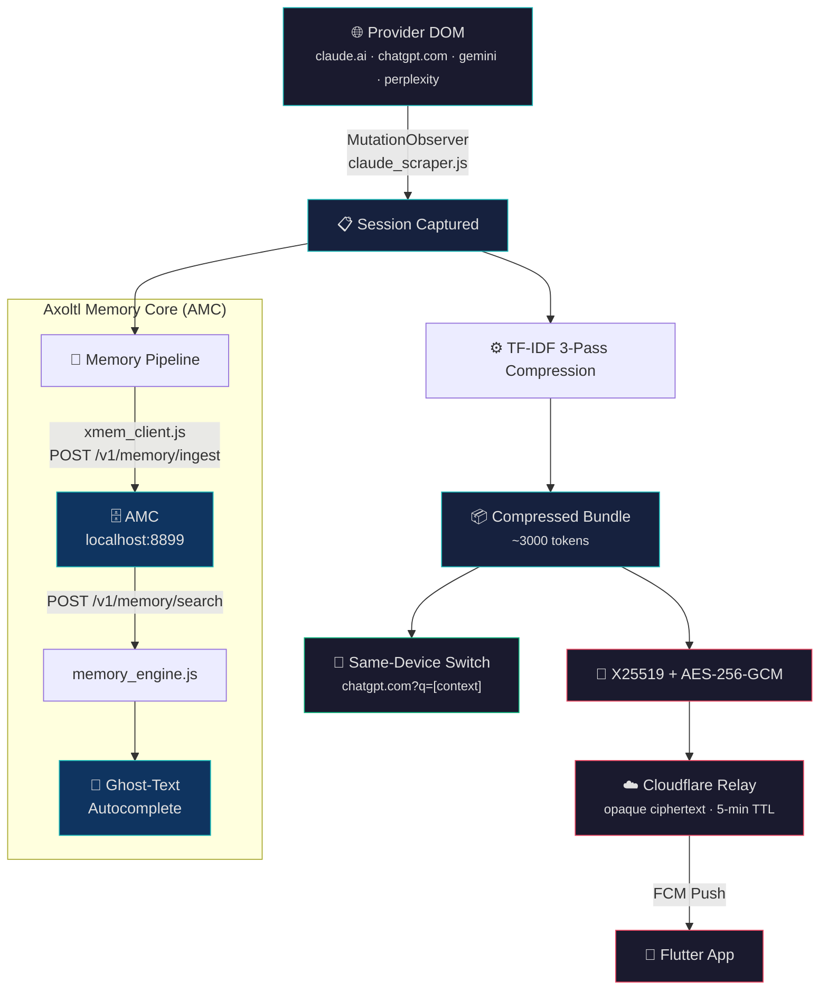
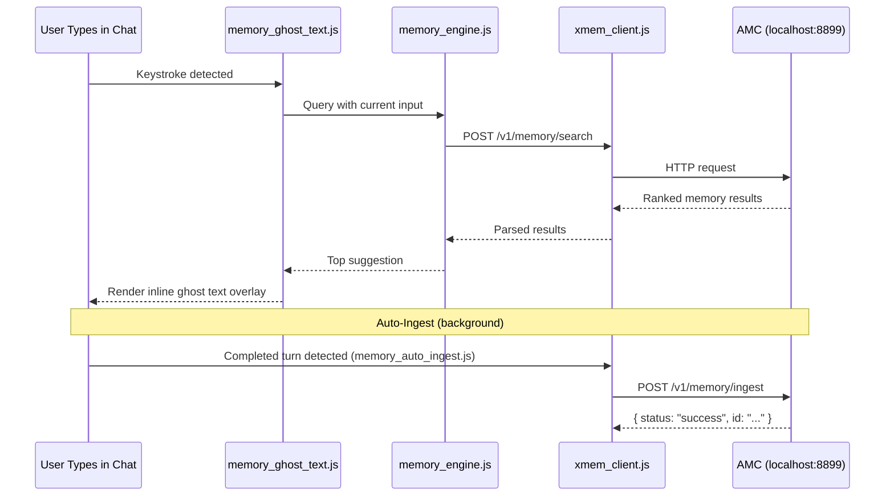

<p align="center">
  
</p>

<h1 align="center">🦎 Axoltl Extension — Session Capture & Memory Intelligence</h1>

<p align="center">
    <a href="https://developer.chrome.com/docs/extensions/mv3/intro/"></a>
    <a href="https://opensource.org/licenses/MIT"></a>
    <a href="https://github.com/Vishnu-tppr"></a>
</p>

**When you hit Claude's free usage limit, you shouldn't have to start over.**
Axoltl transfers your full conversation context to ChatGPT, Gemini, or Perplexity
in one click — encrypted end-to-end, no account required, no re-explaining.

The extension is the capture and intelligence layer of the Axoltl ecosystem. It runs on supported provider pages, reads the conversation state visible in the DOM, compresses it, and either injects it into a new provider tab on the same device or encrypts it for delivery to the Axoltl mobile app. In parallel, it feeds conversation turns to the local **Axoltl Memory Core (AMC)** for long-term semantic recall and surfaces real-time ghost-text autocomplete suggestions as you type.

<p align="center">
    <a href="./README_zh.md">Read in Chinese (中文)</a>
</p>

---

## How It Works

The extension sits closest to the source of truth: the provider web page. It observes the active chat, compresses the captured context, and either injects it into a new provider tab on the same device or encrypts it for delivery to the phone. The popup gives the user a deliberate control surface, while the service worker handles notifications and background orchestration.



---

## 🏗️ Project Structure

```
Axoltl-Extension/
├── manifest.json                   # Manifest V3 declaration (v0.3.0)
├── tsconfig.json                   # TypeScript configuration
├── .env                            # Environment variables (relay URLs)
│
├── background/
│   └── service_worker.js           # Background orchestrator (relay push, FCM, tab management)
│
├── content/                        # Content scripts injected per-provider
│   ├── claude_scraper.js           # claude.ai DOM MutationObserver
│   ├── openai_scraper.js           # chatgpt.com / chat.openai.com DOM watcher
│   ├── gemini_scraper.js           # gemini.google.com DOM watcher
│   ├── perplexity_scraper.js       # perplexity.ai DOM watcher
│   ├── quota_detector.js           # Detects provider-specific quota/rate-limit walls
│   ├── context_compressor.js       # TF-IDF 3-pass text compression pipeline
│   ├── provider_injector.js        # Injects compressed context into target provider tabs
│   ├── xmem_client.js              # HTTP client for Axoltl Memory Core (AMC) API
│   ├── memory_engine.js            # Search orchestrator: queries AMC and ranks results
│   ├── memory_ghost_text.js        # Real-time autocomplete overlay in chat input fields
│   ├── memory_commands.js          # Slash-command interface (/recall, /forget, /search)
│   ├── memory_auto_ingest.js       # Background auto-ingestion of completed conversation turns
│   └── memory_injector.js          # Injects retrieved AMC context into provider prompt fields
│
├── popup/
│   ├── popup.html                  # Extension popup UI shell
│   ├── popup.js                    # State machine: provider detection, handoff triggers, QR pairing
│   └── popup.css                   # Premium teal-glow UI theme
│
├── crypto/
│   ├── noise.js                    # Noise Protocol XX handshake (BLE + relay key exchange)
│   └── qrcode.js                   # QR code encoder for device pairing
│
├── libs/
│   └── qrcode.min.js              # Vendored QR code rendering library
│
└── assets/                         # SVG mascots, animated states, provider icons
    ├── axoltl-animated.svg         # Main animated mascot
    ├── axoltl-thinking-animated.svg
    ├── axoltl-success-animated.svg
    ├── axoltl-sleep-animated.svg
    ├── axoltl-handoff-animated.svg
    ├── axoltl-handoff-explain-animated.svg
    ├── axoltl-handoff-scenario-a.svg
    ├── axoltl-handoff-scenario-b.svg
    ├── axoltl-handoff-scenario-c.svg
    ├── axoltl-handoff-scenario-d.svg
    ├── axoltl-icon-{16,32,48,128}.png   # Extension toolbar icons
    └── claude.webp, chatgpt.png, ...    # Provider logos
```

---

## 📡 Supported Providers & Content Script Matrix

Each provider page receives a tailored scraper plus the full shared pipeline. All scripts run at `document_idle` on the top frame only:

| Provider Domain | Scraper | Shared Pipeline (always injected) |
| :--- | :--- | :--- |
| `claude.ai` | `claude_scraper.js` | `quota_detector` · `context_compressor` · `provider_injector` · `xmem_client` · `memory_engine` · `memory_ghost_text` · `memory_commands` · `memory_auto_ingest` · `memory_injector` |
| `chatgpt.com` / `chat.openai.com` | `openai_scraper.js` | *(same shared pipeline)* |
| `gemini.google.com` | `gemini_scraper.js` | *(same shared pipeline)* |
| `perplexity.ai` / `www.perplexity.ai` | `perplexity_scraper.js` | *(same shared pipeline)* |

### What Each Layer Does

| Script | Layer | Purpose |
| :--- | :--- | :--- |
| `*_scraper.js` | **Capture** | Attaches a `MutationObserver` to the provider's chat DOM, extracts user/assistant turns, and normalizes them into a structured conversation payload. |
| `quota_detector.js` | **Detection** | Monitors provider-specific UI signals (rate-limit banners, disabled send buttons) to detect when the user has hit a usage ceiling. |
| `context_compressor.js` | **Compression** | Applies a TF-IDF 3-pass text compression algorithm to reduce conversation payloads to ~3000 tokens while preserving semantic fidelity. |
| `provider_injector.js` | **Injection** | Launches a new tab for the target provider and injects compressed context as a pre-filled `?q=` prompt parameter. |
| `xmem_client.js` | **AMC Client** | HTTP client wrapper for the local Axoltl Memory Core API (`localhost:8899`). Handles `POST /v1/memory/ingest`, `POST /v1/memory/search`, and `POST /v1/memory/retrieve`. |
| `memory_engine.js` | **Search** | Orchestrates semantic search queries against AMC, ranks results by cosine similarity, and formats them for UI consumption. |
| `memory_ghost_text.js` | **Autocomplete** | Renders inline ghost-text suggestions in the active chat input field, powered by real-time AMC vector search results. |
| `memory_commands.js` | **Commands** | Provides a slash-command interface (`/recall`, `/forget`, `/search`) for explicit memory operations within the chat input. |
| `memory_auto_ingest.js` | **Auto-Ingest** | Silently ingests completed conversation turns (user query + assistant response) into AMC in the background without user intervention. |
| `memory_injector.js` | **Context Inject** | Retrieves relevant long-term memories from AMC and injects them as context preambles into the provider's prompt field before sending. |

---

<div align="center">

```text
┌─────────────────────────────────────────────────────────┐
│                    THE HANDOFF MATRIX                   │
├──────────┬──────────────────────────────────────────────┤
│    A     │ claude.ai → quota wall → chatgpt.com         │
│          │ Same device · One click · Full context       │
├──────────┼──────────────────────────────────────────────┤
│    B     │ Extension → Encrypt → Relay → Push → Phone   │
│          │ Laptop to phone · Encrypted · Any network    │
├──────────┼──────────────────────────────────────────────┤
│    C     │ Phone → QR Code → Chrome → Full Context      │
│          │ Phone to laptop · Scan · Two seconds         │
├──────────┼──────────────────────────────────────────────┤
│    D     │ Account A → Limit → Account B → Intact       │
│          │ Same AI · Fresh quota · Context preserved    │
├──────────┼──────────────────────────────────────────────┤
│    E     │ BLE Beacon → Noise XX → GATT → Offline       │
│          │ Phone to phone · No internet · Encrypted     │
└─────────────────────────────────────────────────────────┘
```

</div>

## ✨ Handoff Scenarios

### 1. Same Device: App-to-App (Zero BLE)

<table><tr>
<td width="60%">

Transfer context instantly between desktop AI clients. When Claude hits a quota wall, click "Switch to ChatGPT" and your full conversation is compressed, opened in a new tab, and pre-filled as a continuation prompt.

</td>
<td width="40%">


</td>
</tr></table>

### 2. Laptop to Phone (Encrypted Relay + Mobile Browser)

<table><tr>
<td width="60%">

Push your exact session state from your computer to your phone through encrypted relay delivery. On mobile, the Axoltl app opens ChatGPT or Claude in the browser with a pre-filled `?q=` handoff prompt so you can tap Send once to continue.

</td>
<td width="40%">


</td>
</tr></table>

### 3. Phone to Laptop (Relay + Optional QR)

<table><tr>
<td width="60%">

Move mobile context back to desktop using relay pull, then continue via desktop tab prefill (`?q=`) with extension-assisted injection. Optional QR remains available for explicit user-driven continuation.

</td>
<td width="40%">


</td>
</tr></table>

### 4. Same Device: Context Carry (Account Swap)

<table><tr>
<td width="60%">

Working across multiple accounts? The extension holds the conversation in memory while you sign out and sign in to a fresh account, then cleanly injects the context into the new session.

</td>
<td width="40%">


</td>
</tr></table>

### ☁️ The Cloud Pack & Unpack Protocol

<table><tr>
<td width="60%">

Under the hood, Axoltl securely packages your session and bridges it via short-lived encrypted relay blobs with a 5-minute TTL.

</td>
<td width="40%">


</td>
</tr></table>

---

## 🧠 Axoltl Memory Core (AMC) Integration

The extension communicates with the local **Axoltl Memory Core** server running on `localhost:8899` to provide persistent, semantic long-term memory across sessions:



### AMC Slash Commands

The `memory_commands.js` module provides an in-chat command interface:

| Command | Action |
| :--- | :--- |
| `/recall <query>` | Search AMC for memories matching the query and display results inline. |
| `/search <query>` | Raw semantic vector search against the local database. |
| `/forget <id>` | Remove a specific memory entry from the local store. |

---

## 🔒 Security

- Content scripts run **only** on the provider domains listed in `manifest.json` — no wildcard host permissions.
- Captured context is compressed locally using TF-IDF before any transfer occurs.
- **X25519 key exchange** and **AES-256-GCM encryption** protect all relay and QR transfers.
- The Cloudflare relay receives only opaque ciphertext; it never has access to decryption keys or plaintext transcripts.
- Host permissions are scoped to the 4 supported AI providers, the relay endpoint, and the local AMC server (`localhost:8899`).
- Quota detection happens entirely in-page — the extension reacts to UI state the user can already see.
- Content Security Policy restricts extension pages to `self` origin with scoped font exceptions only.

---

## ⚡ Quick Start

```bash
git clone https://github.com/Vishnu-tppr/Axoltl.git
cd Axoltl/Axoltl-Extension
```

1. Open Chrome → `chrome://extensions/`
2. Enable **Developer mode** (top right toggle)
3. Click **Load unpacked** → select the `Axoltl-Extension` folder
4. Visit `claude.ai`, `chatgpt.com`, `gemini.google.com`, or `perplexity.ai`
5. *(Optional)* Start the local AMC server for long-term memory features:
   ```bash
   cd ../Axoltl-Memory-Core
   python -m venv venv && .\venv\Scripts\Activate.ps1
   pip install -r requirements.txt
   python app.py
   ```

---

## 🤝 Contributing

Changes that improve provider detection, popup clarity, memory accuracy, or bundle correctness are welcome. Keep the capture logic explicit, keep the transfer path short, and do not expand the extension into a chat client.

---

## 🌟 Star History

<p align="center">
 <a href="https://www.star-history.com/?repos=Vishnu-tppr%2FAxoltl-Extension.git%2CVishnu-tppr%2FAxoltl-App.git&type=date&legend=top-left">
     <picture>
          <source media="(prefers-color-scheme: dark)" srcset="https://api.star-history.com/chart?repos=Vishnu-tppr/Axoltl-Extension.git%2CVishnu-tppr/Axoltl-App.git&type=date&theme=dark&legend=top-left" />
          <source media="(prefers-color-scheme: light)" srcset="https://api.star-history.com/chart?repos=Vishnu-tppr/Axoltl-Extension.git%2CVishnu-tppr/Axoltl-App.git&type=date&legend=top-left" />
          
     </picture>
 </a>
</p>

## 📄 License

MIT — this repository is released under the MIT License.

Built with ❤️ by [@Vishnu-tppr](https://github.com/Vishnu-tppr).
