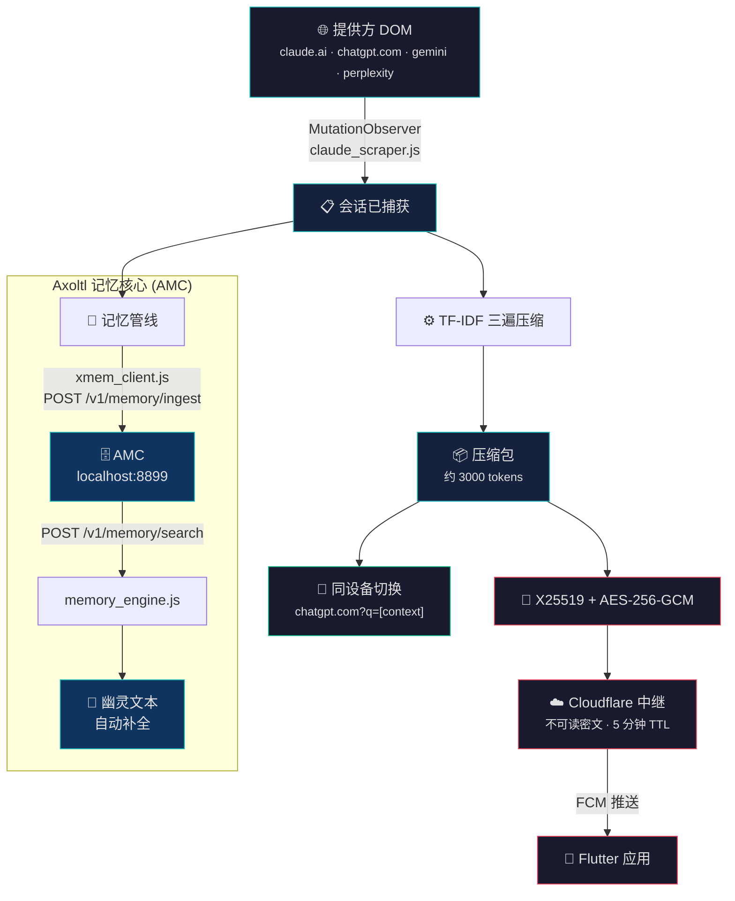
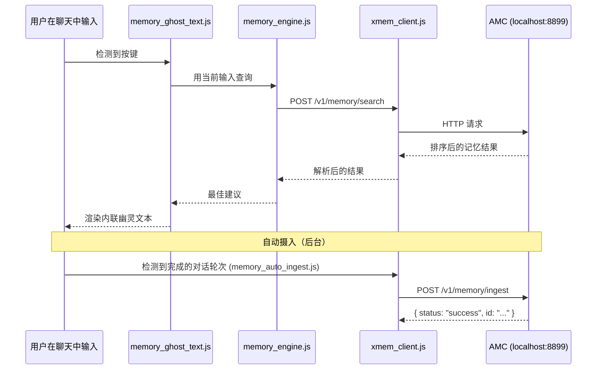

<p align="center">
  
</p>

[](https://opensource.org/licenses/MIT)
[](https://github.com/Vishnu-tppr/Axoltl)
[](https://github.com/Vishnu-tppr/Axoltl/pulls)
[](https://github.com/Vishnu-tppr/Axoltl)
[](manifest.json)

# Axoltl - 用于会话抓取的 Chrome 扩展

> 这个扩展会监听受支持的 AI 网页应用，抓取当前会话状态，并把一次额度触顶变成干净的交接。

---

## 它做什么

这个扩展是 Axoltl 的抓取端。它运行在受支持的提供方页面上，读取已经显示在 DOM 里的会话状态，再把这些状态变成交接包。当出现额度墙时，它可以在同一设备上切换到另一个提供方，或者通过加密中继把数据包送到手机。

这样用户就能继续留在自己已经在用的网页客户端里。扩展不会托管会话；它只负责保留并移动会话。

---

## 在系统中的角色

扩展最靠近事实来源，也就是提供方网页。它观察当前聊天，压缩抓到的上下文，然后要么在同一设备上把它注入到新的提供方标签页，要么加密后发送到手机。弹窗提供明确的用户控制面，而后台 service worker 负责通知和后台编排。



---

## 🧠 Axoltl 记忆核心 (AMC) 集成

扩展通过本地运行在 `localhost:8899` 上的 **Axoltl 记忆核心** 服务器，提供跨会话的持久语义长期记忆：



### AMC 斜杠命令

`memory_commands.js` 模块提供聊天内命令界面：

| 命令 | 操作 |
| :--- | :--- |
| `/recall <查询>` | 在 AMC 中搜索匹配的记忆并内联显示结果 |
| `/search <查询>` | 直接对本地数据库进行原始语义向量搜索 |
| `/forget <id>` | 从本地存储中移除指定的记忆条目 |

---

## 🔒 安全性

- 内容脚本只会运行在 `manifest.json` 中列出的提供方域名上——没有通配符主机权限。
- 抓取到的上下文会先在本地通过 TF-IDF 压缩，然后才会开始传输。
- **X25519 密钥交换** 和 **AES-256-GCM 加密** 保护所有中继和二维码传输。
- Cloudflare 中继只接收不透明密文，绝不接触解密密钥或明文转写。
- 主机权限限定于 4 个受支持的 AI 提供方、中继端点和本地 AMC 服务器（`localhost:8899`）。
- 额度检测完全发生在页面内部——扩展响应的是用户已经能看到的 UI 状态。
- 内容安全策略将扩展页面限制为 `self` 来源，仅开放字体范围例外。

---

## 快速开始

```bash
git clone https://github.com/Vishnu-tppr/Axoltl.git
cd Axoltl/extension
```

将这个文件夹作为未打包扩展加载到 Chrome 中，然后打开 `claude.ai`、`chatgpt.com` 或 `gemini.google.com` 的页面。

---

<p align="center">
     <a href="./README.md">Read in English</a>
</p>

---

## 接力矩阵

```text
┌─────────────────────────────────────────────────────────┐
│                    接力矩阵                              │
├──────────┬──────────────────────────────────────────────┤
│    A     │ claude.ai → 额度墙 → chatgpt.com            │
│          │ 同一设备 · 一键 · 完整上下文                 │
├──────────┼──────────────────────────────────────────────┤
│    B     │ 扩展 → 加密 → 中继 → 推送 → 手机             │
│          │ 笔记本到手机 · 加密 · 任意网络               │
├──────────┼──────────────────────────────────────────────┤
│    C     │ 手机 → 二维码 → Chrome → 完整上下文          │
│          │ 手机到电脑 · 扫码 · 两秒完成                 │
├──────────┼──────────────────────────────────────────────┤
│    D     │ 账号 A → 限额 → 账号 B → 上下文保持          │
│          │ 同一模型 · 新额度 · 上下文不丢失             │
├──────────┼──────────────────────────────────────────────┤
│    E     │ BLE Beacon → Noise XX → GATT → 离线          │
│          │ 手机到手机 · 无需联网 · 加密                 │
└─────────────────────────────────────────────────────────┘
```

## ✨ 接力矩阵与功能

我们的核心理念是在不同硬件和软件条件下都保持绝对的上下文连续性。下面是 Axoltl 在后台处理数据传输的方式。

### 1. 同一设备：应用到应用（零 BLE）

<table><tr>
<td width="60%">

在桌面 AI 客户端之间，通过本地路径即时传递上下文。

</td>
<td width="40%">



</td>
</tr></table>

### 2. 笔记本到手机（加密中继 + 移动端浏览器）

<table><tr>
<td width="60%">

把电脑上的会话状态通过加密中继推送到手机。在移动端，Axoltl 会在浏览器中打开 ChatGPT 或 Claude，并预填 `?q=` 接力提示词，用户只需点一次发送即可继续。

</td>
<td width="40%">


</td>
</tr></table>

### 3. 手机到笔记本（中继 + 可选二维码）

<table><tr>
<td width="60%">

通过中继拉取把移动端上下文带回桌面，然后通过桌面标签页预填 (`?q=`) 和扩展辅助注入继续对话。二维码仍然保留，用于用户显式驱动的继续方式。

</td>
<td width="40%">


</td>
</tr></table>

### 4. 同一设备：上下文迁移（账号切换）

<table><tr>
<td width="60%">

在多个账号之间切换时，Axoltl 会先把上下文带到新标签页，然后你再手动登录完成账号切换。

</td>
<td width="40%">


</td>
</tr></table>

### ☁️ 云端打包与拆包协议
<table><tr>
<td width="60%">

在底层，Axoltl 会安全地打包你的会话，并通过短生命周期的加密中继 blob 进行桥接。

</td>
<td width="40%">



</td>
</tr></table>

## 🏗 项目架构

```text
axoltl/
├── extension/                  # Chrome Manifest V3 发送端
│   ├── manifest.json           # V3 声明
│   ├── content/
│   │   ├── claude_scraper.js   # claude.ai DOM 观察器
│   │   ├── openai_scraper.js   # ChatGPT DOM 观察器
│   │   └── quota_detector.js   # 限额检测
│   ├── background/
│   │   └── service_worker.js   # 编排器
│   ├── popup/
│   │   ├── popup.html          # UI 外壳
│   │   ├── popup.js            # 状态机
│   │   └── popup.css           # 样式
│   ├── crypto/
│   │   ├── noise.js            # Noise Protocol XX
│   │   └── qrcode.js           # 二维码编码器
│   ├── assets/
│   │   ├── axoltl-thinking-animated.svg
│   │   └── axoltl-icon-48.svg
│   └── README.md               # 本文件
└── Axoltl App                  # 应用源码：https://github.com/Vishnu-tppr/Axoltl-App.git
```

## 安全性

- 内容脚本只会运行在 `manifest.json` 中列出的提供方域名上。
- 抓取到的上下文会先在本地压缩，然后才会开始传输。
- X25519 和 AES-256-GCM 会让同设备和中继传输保持加密。
- 中继只会收到不可读的密文；它永远不需要明文转写。
- 主机权限只限制在受支持的提供方和中继端点上。
- 额度检测发生在页面内部，因此扩展响应的是用户已经能看到的 UI 状态。

---

## 参与贡献

欢迎改进提供方检测、弹窗清晰度或数据包正确性的拉取请求。请保持抓取逻辑明确、传输路径简短，并且不要把扩展扩展成聊天客户端。

## 🌟 星标历史

<p align="center">
 <a href="https://www.star-history.com/?repos=Vishnu-tppr%2FAxoltl-Extension.git%2CVishnu-tppr%2FAxoltl-App.git&type=date&legend=top-left">
     <picture>
          <source media="(prefers-color-scheme: dark)" srcset="https://api.star-history.com/chart?repos=Vishnu-tppr/Axoltl-Extension.git%2CVishnu-tppr/Axoltl-App.git&type=date&theme=dark&legend=top-left" />
          <source media="(prefers-color-scheme: light)" srcset="https://api.star-history.com/chart?repos=Vishnu-tppr/Axoltl-Extension.git%2CVishnu-tppr/Axoltl-App.git&type=date&legend=top-left" />
          
     </picture>
 </a>
</p>

## 许可

MIT - 本仓库采用 MIT 许可证。

由 [@Vishnu-tppr](https://github.com/Vishnu-tppr) 用 ❤️ 制作。